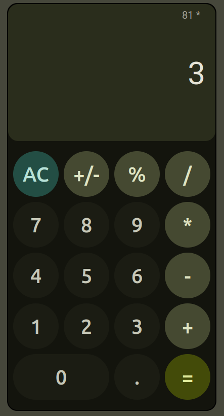

# Calculator-JS

A simple calculator application built with JavaScript.

## Overview
Calculator-JS is a lightweight, web-based calculator that performs basic arithmetic operations. It's built with pure JavaScript, HTML, and CSS.

## Demo
[Click here for a live demo!](https://pective.github.io/calculator-js)

## Contributing
Contributions are welcome! Please feel free to submit a Pull Request.
